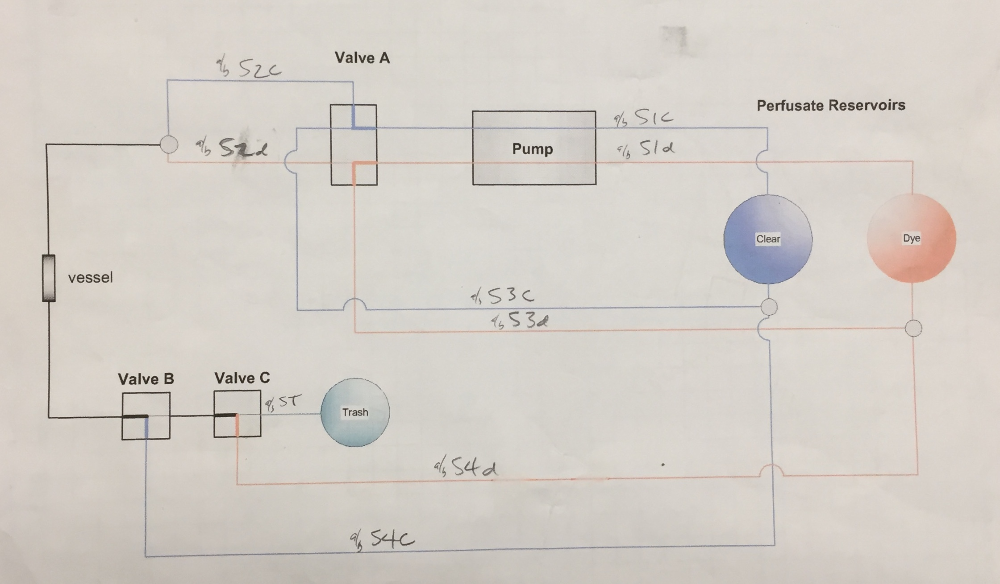
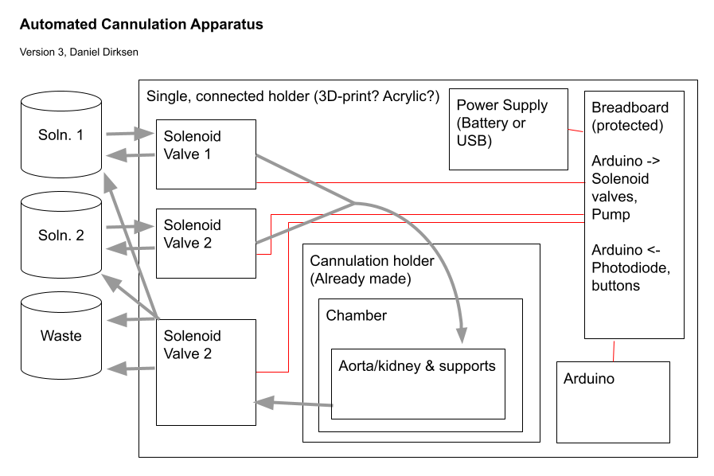
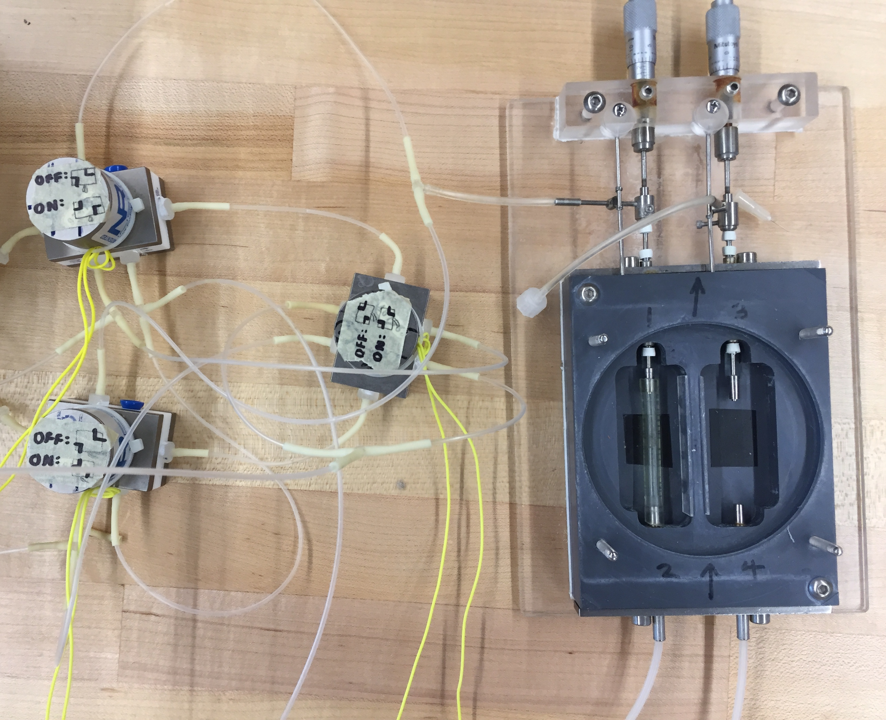
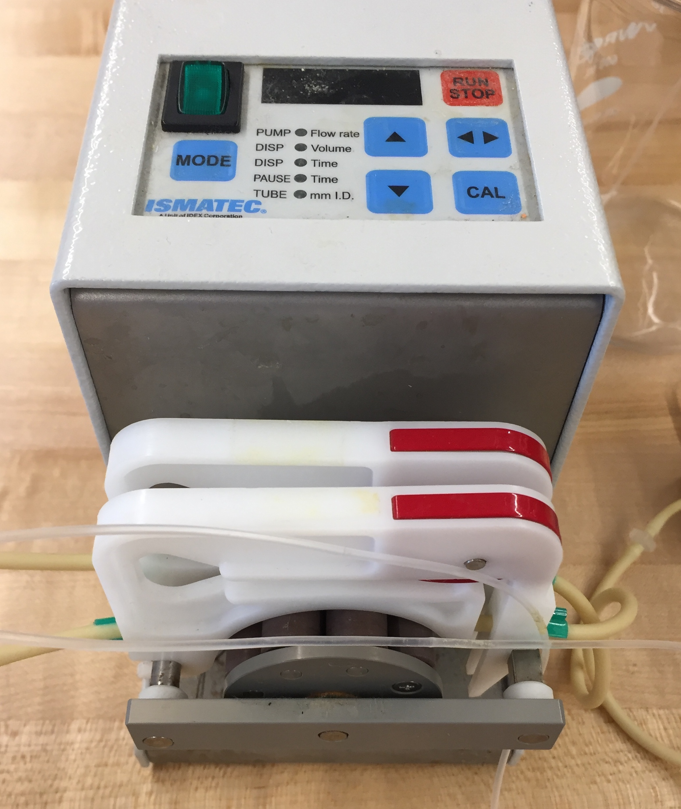
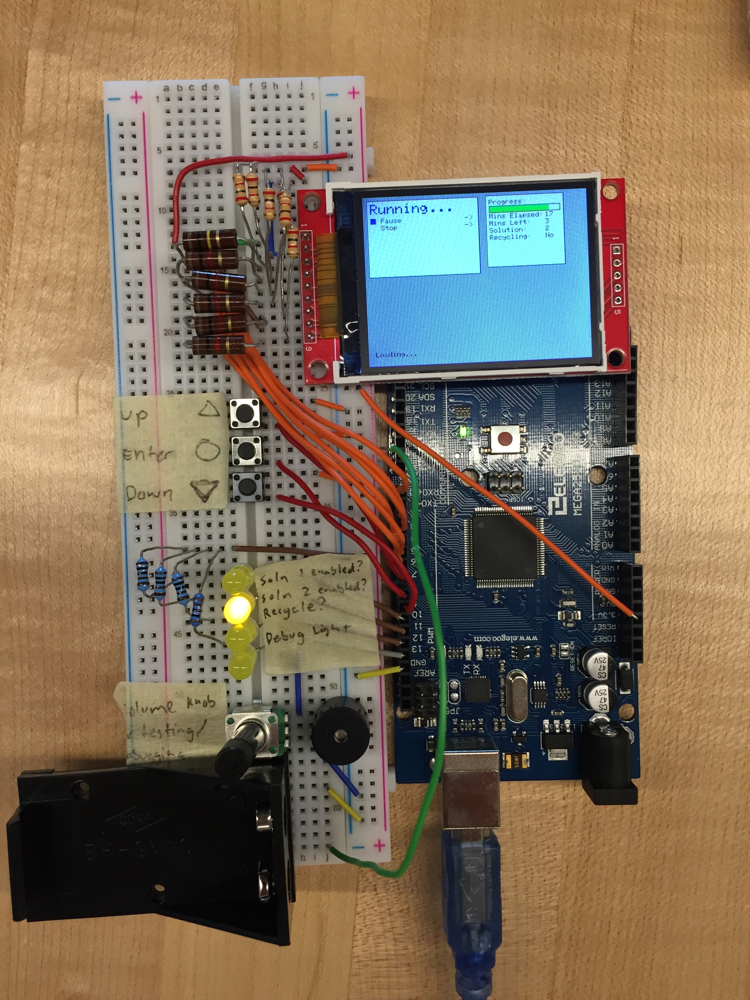
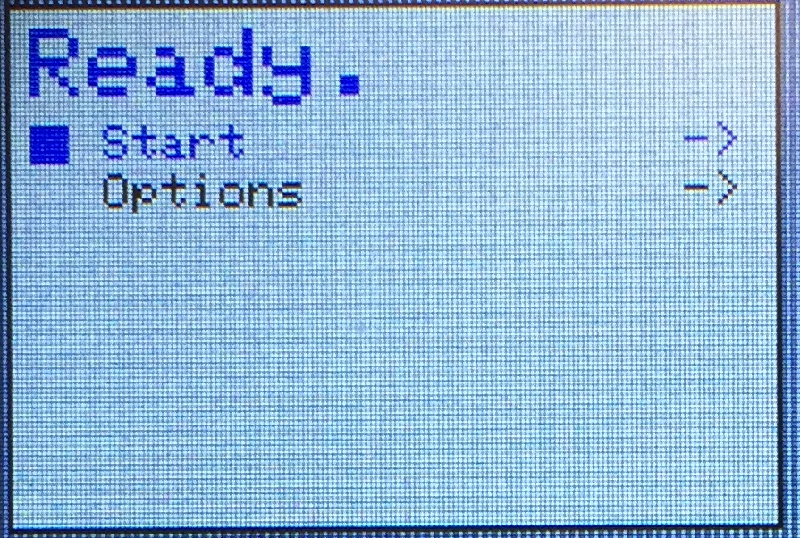
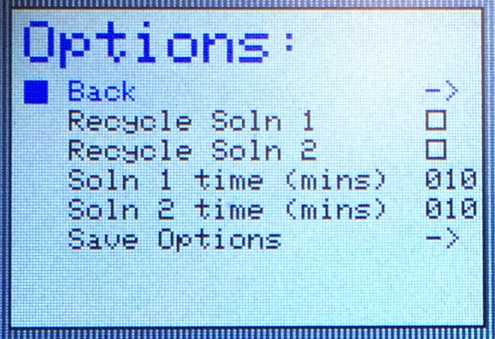
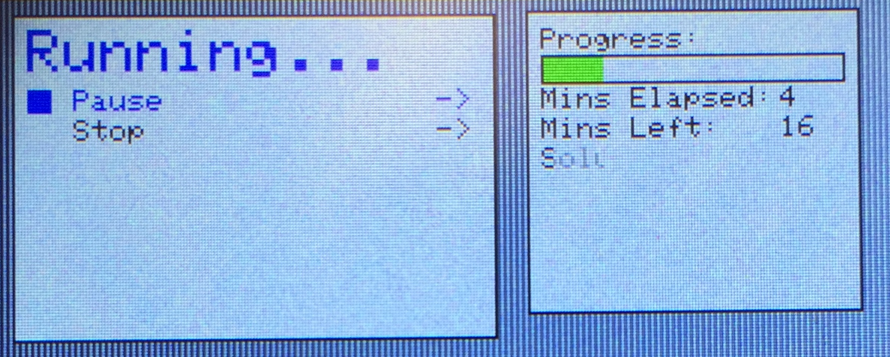
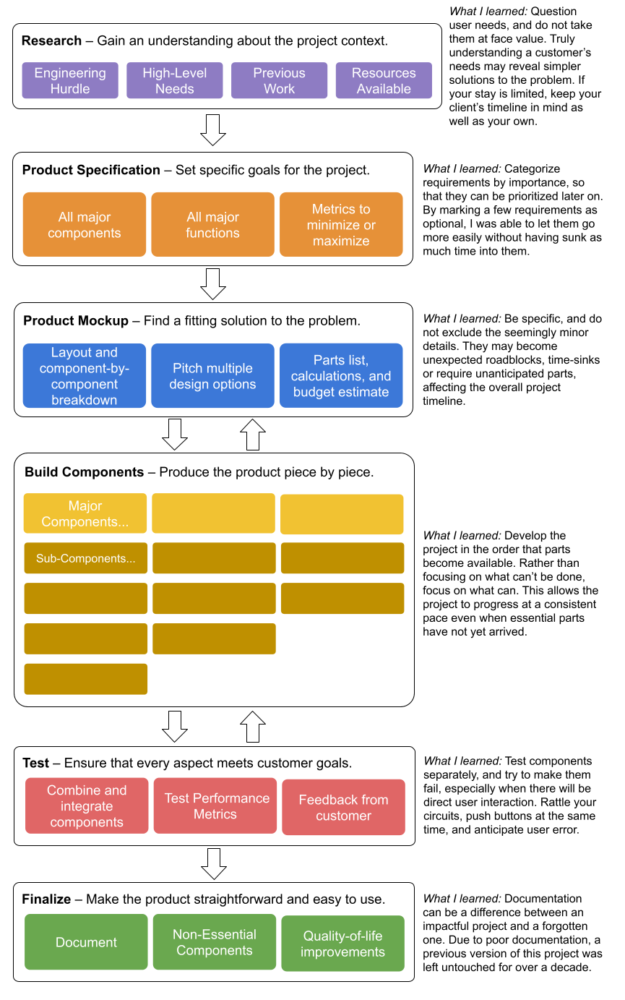

# Automated Cannulation System

## Abstract

IS THIS AN EXPERIMENT YOU'VE DONE BEFORE OR SOMETHING YOU PLAN TO DO?

NEW EXPERIMENT? HAS THIS OR SOMETHING SIMILAR BEEN DONE BEFORE?

The goal of this project was to create custom hardware that opens the door to new heart disease research to the Department of Biological Sciences. The machine operates like a configurable cappuccino machine, pumping two chemicals, one after the other, through the main blood vessel of a mouse.

A previous attempt at this machine has been made, but for decades it was unusable due to lack of documentation and changing research needs. In this project, a new system was designed with simplicity, consistency, and ease of use in mind. The project aimed to reduce systematic error, to increase reproducibility, and lower standard deviation while being configurable enough to support a variety of experiments.

Dr. Kit Ng, the head researcher of this project, intends to use this machine to study heart disease, a major cause of death worldwide. For example, Dr. Ng intends to study how material can be built up or dislodged from the inner lining of arteries by high-density lipoproteins of various molecular sizes. This may offer insights into the underlying patterns behind the cause and prevention of heart disease on a molecular scale.

---

## Background

### Key Concepts

Cannulation is the insertion of a thin tube into a blood vessel or another body cavity [1]. Once this is done, chemicals can be pumped through. This operation has a variety of biomedical applications, both in research and in practice. It can be done *in vivo* (on a living subject, such as on a patient's arm) or *in vitro* (in isolation, such as on a mouse organ).

The *in vitro* cannulation of mice is of special interest to Dr. Kit Ng, who believes that this alternate way of cannulation may answer some questions about Coronary Artery Disease.

Caused by plaque buildup in the inner lining of the arteries [2], Coronary Artery Disease (CAD) is the most common form of heart disease and is a major cause of death, affecting about 6.7% of the population [3].

The presence of plaque in arteries can be measured using a bioflourescent, lipophilic dye called *DiI*, pronounced "Dye Aye" [4]. It can be excited by a 545 nm light and emmits a 555 nm light which can be measured using specialized lenses and imaging.

Buildup can be dislodged from the arteries by a high-density lipoprotein (HDL) cholesterol [4]. This type of "good" cholesterol takes many forms, differing greatly in molelcular size. It is known that different HDLs may be more or less active, or more or less effective at removing buildup. However, the causes of these differences are not understood. With this machine and access to synthesized HDLs of varying properties, Dr. Ng and his interns will be able to shed light on this disputed issue and demonstrate how these differences can be measured.

###Research

One possible experiment using this system is to test how the size of HDL affects its effectiveness. One solution, containing DiI, is pumped through the aorta (the largest artery) of a mouse for up to an hour. This solution sticks to and lines the aorta. Then a second solution, containing HDL, is pumped through the same way with the goal of remove the first solution. The remnants of the first solution are measured in the aorta using imaging, to quantify the effect of the HDL.

To do this experiment manually requires consistent timing and multitasking, from which arises the risk of systematic error, inconsistency, and expensive mistakes.

###Previous work

The need for a specialized system to perform this experiment started two decades ago when Rutledge and his collegues created a similar system to handle this problem. However, due to its difficulty to use, a lack of documentation, and changing research needs, the experiment was scrapped and components of it were reused.

Some documentation of previous work on the project. Tubing layout differs significantly from the new design.

## Objectives for the Machine

- To provide a simple, reproducable way to move two chemicals in series through a biological specimen.
- To reduce systematic error, increase reproducibility, and lower standard deviation for future biological research.
- To be user-friendly and easy for professors and interns to use.
- To be flexible enough to serve as a base for a variety of experiments and specimens.

## Materials

- Arduino MEGA 2560
- (3) NResearch 12V DC 30 PSI Solenoid Valves. P/N: 360T041
- Generic breadboard, wiring, LEDs, buttons, resistors, active buzzer
- 2.2 TFT SPI 240x320 pixel display
- (3) 1N4004 Snuffer Diodes
- ISMATEC Peristaltic pump with two cassettes
- Generic waterproof tubing
- 12V AC to DC Power Supply Module
- NOYITO 4-Channel 12V Relay Module
- (Future) 3d-Printed PLA Casing

---

## Results

The above figure shows the overall layout of the system. The system has three main parts, the tubing setup, the controller setup, and the inteface.

### Tubing Setup

The red rectangle highlights a peristaltic pump which moves two test solutions through their respective tubing and into the system. Because the aparatus does not control the pump, the tubing configuration was designed so that the pump can be left on even when the experiement is not running; pumped solutions will be automatically deposited back into their respective resevours.

The blue rectangle highlights the place where the canulation takes place. The cannulation chamber is filled with a fluid and houses one mouse aorta or another specimen. The two solutions are pushed through the specimen, one after the other, at a flow rate configured by the user.

The green rectangle highlights the final step, where the solution currently pumping through gets either recycled (deposited back into its origional container) or discarded, depending on a signal from the control module.

A working solenoid valve layout for tubing.

A peristaltic pump used to push both solutions through the experiment.

### Controller Setup

An Arduino MEGA controls the solenoid pumps in a predifined procedure configured by the user through the user interface. The arduino sends a signal between 0 and 5 Volts on three wires. These connect to a four-way 12-Volt relay which amplifies the signal to 12 Volts, as required by the solenoid valves. It also displays a menu to the user on an SPI display module, allowing the proceedure to be started, configured, or halted. It takes input from three buttons, which are used to navigate the menu and manage the proceedure.

### Interface

Displayd on an

SPECIFICS OF DISPLAY,

a graphical user interface allows the user to start, stop, and configure the proceedure. The user may configure the timing of the experiment and whether each solution is recycled or wasted. A state machine manages the interface navigation and updates the display only as necessary. The software is written in C++ using `Adafruit_ILI9341` Library. For future scalability, logic and content are kept seperate. The source code can be found in the project's public github repository.

---

## Conclusion

- While the task it does is simple, this system serves as a reliable research tool and enables the revival of research which started decades ago with Dr. John Rutledge.
- This project has been a multidisplinary experience, requiring systems thinking and working on multiple levels of detail. It required communication, project management, planning, and a sense urgency in order to complete on fixed deadline.

## Full Project Process

This is an abstract overview of an approach to engineering which has been both demonstrated and developed by this 8-week project. It reveals the problem-solving approach to an single-person engineering task as well as the lessons learned throughout the design process.

## References

Fryar CD, Chen T-C, Li X. Prevalence of uncontrolled risk factors for cardiovascular disease: United States, 1999–2010 pdf icon[PDF-494K]. NCHS data brief, no. 103. Hyattsville, MD: National Center for Health Statistics; 2012. Accessed June 28, 2021.

1. https://oed.com/view/Entry/27141#eid10095333
2. https://www.cdc.gov/heartdisease/coronary_ad.htm
3. https://www.cdc.gov/nchs/data/databriefs/db103.pdf
4. J.C. Rutlede et. al. Direct Visualization of Lipid Deposition and Reverse Lipid Transport in a perfused Artery

## Acknowledgements

Dr. Elaine Wong, Faculty at CPE Department, Biola University. SEI 2021 Mentor.
Stanley Ng, Chair of CPE Department, Biola University. SEI 2021 Mentor.
Dr. Kit Ng, Department of Biological Sciences, Biola University. Head of the project.
Dr. John Rutledge, Vice Chair of Research, U.C. Davis. Pioneered the visualization of LDL, adhesion to blood vessels.
